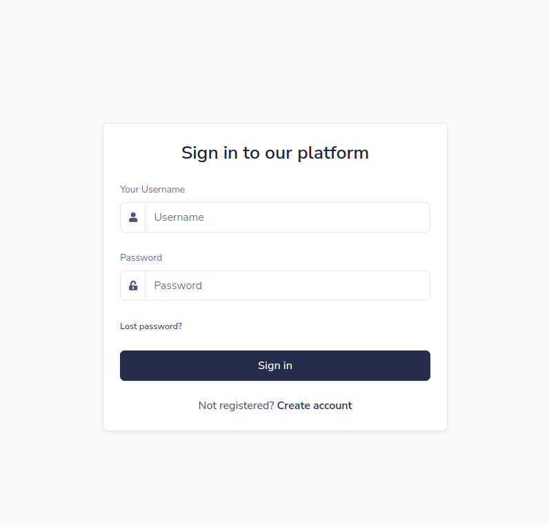
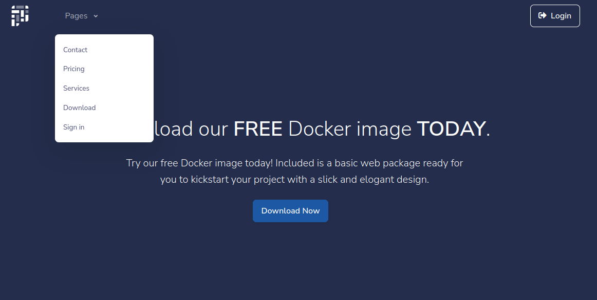
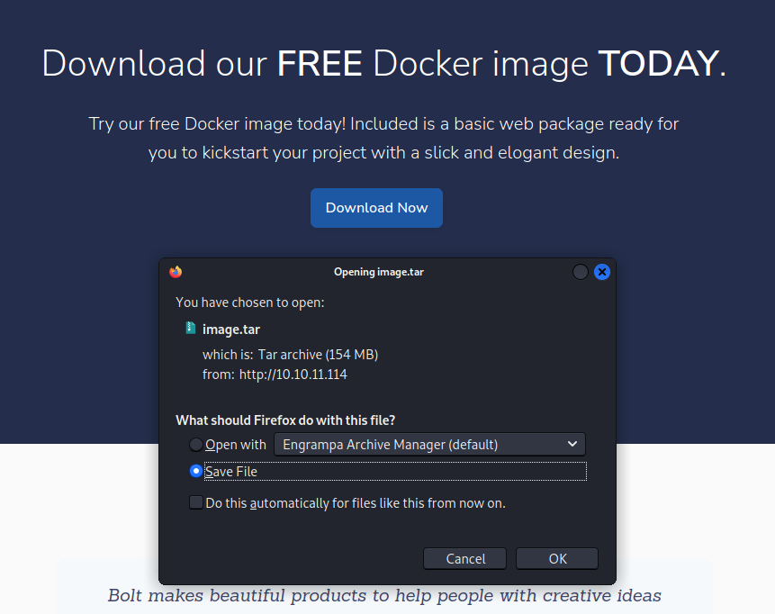
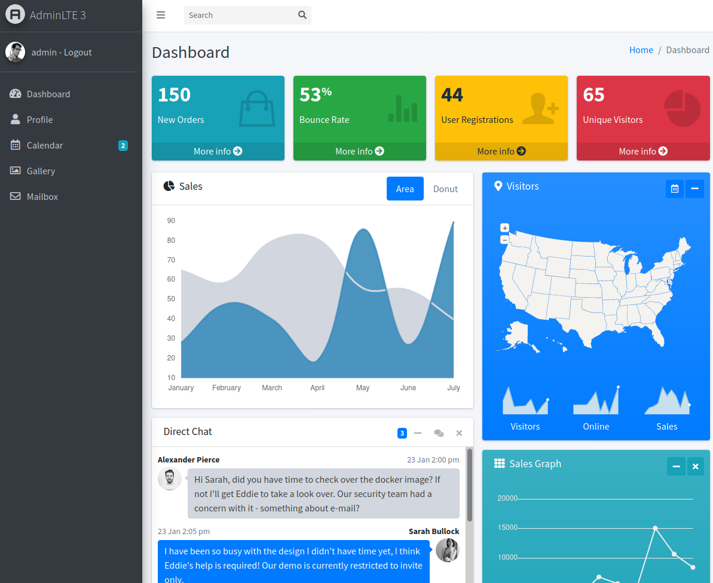
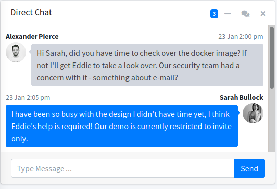

# Bolt 10.10.11.114

Core Concepts:

- SSTI
- Password Reuse
- PGP Private Key Cracking

## Enumeration

As is tradion let's get started with an nmap scan
```
nmap -sV -sC 10.10.11.114 -o nmap.bolt.txt
```
nmap reveals 3 open ports; 22, 80 and 442.  22 is ssh and 80 indicates the victim is likely hosting a webserver. 443 I'm unfamiliar with at first glance.
The typical route at this point is to sick gobuster on the webserver.
```
wget https://raw.githubusercontent.com/digination/dirbuster-ng/master/wordlists/common.txt
gobuster dir -u 10.10.11.114 -w common.txt -o gobuster.bolt.txt
```
> Output
```
/contact              (Status: 200) [Size: 26293]
/download             (Status: 200) [Size: 18570]
/index                (Status: 308) [Size: 247] [--> http://10.10.11.114/]
/login                (Status: 200) [Size: 9287]
/logout               (Status: 302) [Size: 209] [--> http://10.10.11.114/]
/pricing              (Status: 200) [Size: 31731]
/profile              (Status: 500) [Size: 290]
/register             (Status: 200) [Size: 11038]
/services             (Status: 200) [Size: 22443]
```
The /login page and /contact page likely have some potential. Anything that has a post method tends to be vulnerable to attacks. And whenever we have some kind of input field we likely have an injectrion vector.



We have two choices here; bruteforce some login creds or enumerate more. In real life we're going to want to spend as much time enumerating our attack vectors as possible. Brute forcing always runs the risk of raising some red flags with the victim.



Browsing back to the landing page we see there's actual a menu link for downloading a tar of the website.  Let's check it out!



## Foothold

Extract the tar file.

``` 
tar -xvf image.tar
cd a4ea7da8de7bfbf327b56b0cb794aed9a8487d31e588b75029f6b527af2976f2
tar -xvf layer.tar
```
Extracting layer.tar you'll notice a `dv.sqlite3` file. Let's dump the tables from the database and see if we can find anything interesting.
```
┌──(taylor㉿DESKTOP-72GCBB0)-[~/Documents/Bolt/image/a4ea7da8de7bfbf327b56b0cb794aed9a8487d31e588b75029f6b527af2976f2]
└─$ sqlite3 db.sqlite3
SQLite version 3.36.0 2021-06-18 18:36:39
Enter ".help" for usage hints.
sqlite> .table
User
sqlite> SELECT * FROM user;
1|admin|admin@bolt.htb|$1$sm1RceCh$rSd3PygnS/6jlFDfF2J5q.||
```
Cash moaney admin creds baaaaybe! The Password is hashed but when has that ever stopped us?
```
john admin_hash --wordlists=~/tools/wordlists/rockyou.txt
```
Reveals our the password is: deadbolt



Using our newly found creds to login the website directs us to the /admin/home page.



After enumerating the admin portal a bit we can see the HTB staff has a sense of humor.  All but giving the solution to users willing to actually read.  Let's see if we can use gobuster to find this 'other platform' they're talking about.

```
gobuster vhost -u http://bolt.htb -t 30 -w /home/taylor/tools/SecLists/Discovery/DNS/subdomains-top1million-20000.txt -o gobuster.vhosts.bolt.txt
```

as a note remember to add bolt.htb to your `/etc/hosts`
